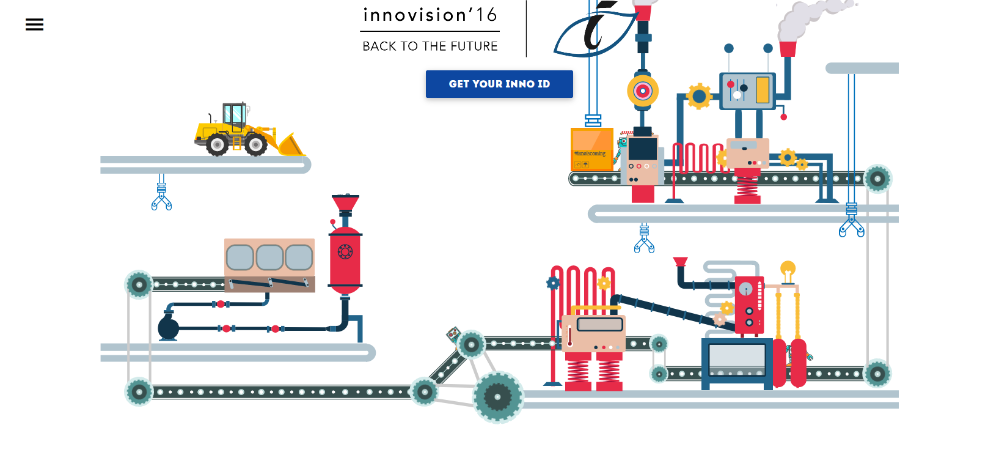
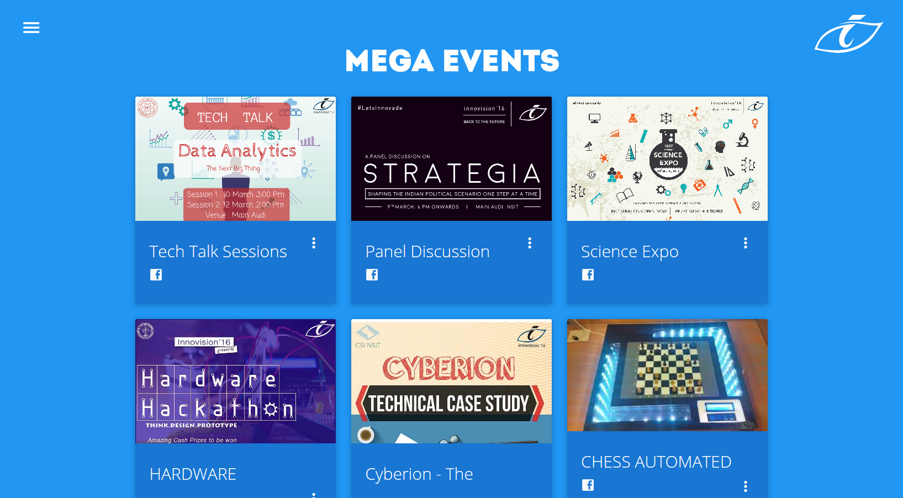

# Inno - A fest website

## [Preview](https://inno.boring.download/)

The site has been deployed using Heroku and MongoDB Atlas Free tiers at https://inno.boring.download/

[](#Homepage)



## The site features the following functions :

1. Login/Register using FB and Local
2. Automatic generation of unique IDs for all users on successfull registration (INNO-ID)
3. Admin and Event Manager(EM) accounts with special functions
4. Create events and update operations for EMs
5. Ability to register for events by users
6. View participants and export to Excel for EMs
7. Automatic mailing through Mailgun on registration
8. Mass mailing to all registered users through Mailgun

## Installation instructions to follow (for Ubuntu 14.04 LTS)

Should work on other versions too, but mongodb is not officially supported on 15.x for now and requires some work arounds.

## Requirements

### nodejs

Installation

    curl -sL https://deb.nodesource.com/setup_14.x | sudo -E bash -
    sudo apt-get install -y nodejs

After Installation

    sudo apt-get install nodejs-legacy

Check that you have node and npm(comes with node) successfully installed:

    $ node -v
    $ npm -v

### mongodb

Installation :
Follow the official instructions at:
https://docs.mongodb.org/manual/tutorial/install-mongodb-on-ubuntu/

Check mongo is installed by starting the server:

      mongod

### libkrb5-dev

Required for mongoose (nodejs module)

    sudo apt-get install libkrb5-dev

### modules:

Clone the project using git and cd into it:

      git clone https://github.com/rohit-gohri/inno.git

      cd inno

Run npm install - this installs all the dependencies of the project (found in package.json) :

      npm install

## Config File

Add a 'production.json' file in the 'config' directory. This file is used to store API keys and various other variable configurations like : site-url, contact-form-email, etc.
It needs to have the following format :

```json
{
  "mailgun": {
    "auth": {
      "api_key": "<your-mailgun-api-key>",
      "domain": "<domain-registered-on-mailgun>"
    }
  },
  "url": "<domain-name-on-which-this-is-setup>",
  "hashids": {
    "secret": "<hash-secret-for-unique-id-generation>",
    "no_chars": 4,
    "chars": "ABCDEFGHIJKLMNOPQRSTUVWXYZ1234567890"
  },
  "contactEmail": "<email-for-contact-form>",
  "dbhost": "<mongodb-host-url",
  "sessionSecret": "<session-secret>",
  "fb": {
    "clientID": "<FB-app-id-for-login>",
    "clientSecret": "<fb-app-secret>",
    "callbackURL": "<site-url> + /login/fb/callback"
  }
}
```

## Run

Start Mongo

    mongod

Start App

    npm start

Or if you are using pm2

    pm2 start pm2_debug.json

## Contributors

### [Code](https://github.com/rohit-gohri/inno/graphs/contributors)

See Github Contributors: https://github.com/rohit-gohri/inno/graphs/contributors

### [Homepage](https://github.com/rohit-95/inno/tree/master/public/assets/robot):

#### Animations & Illustrations By [Utkarsh Yadav](https://github.com/utkarshyadav5): @utkarshyadav5

